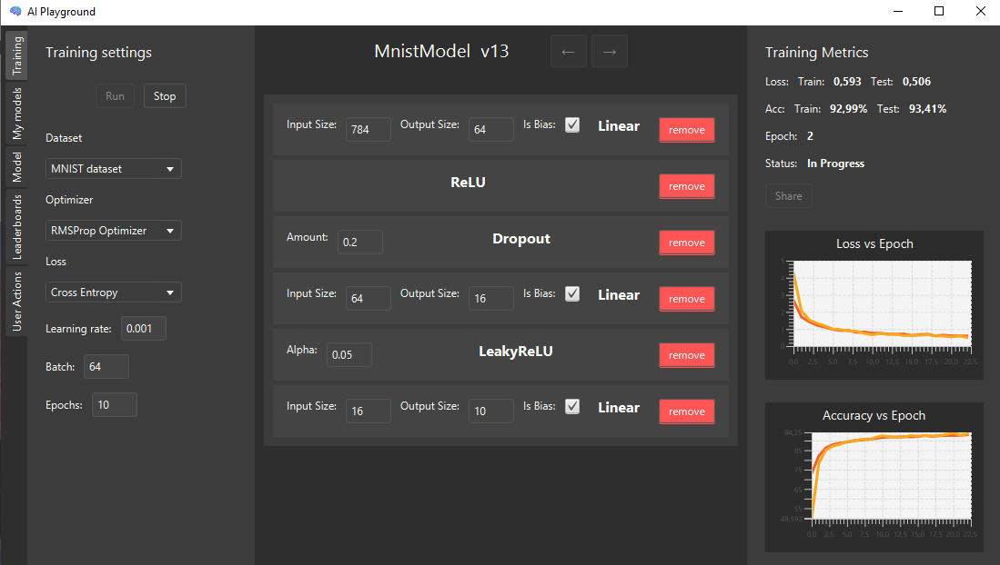

# AI-Playground

**AI-Playground** is a desktop app for experimenting with simple neural networks. It features a built-in token system, leaderboard tracking, and an intuitive JavaFX interface — perfect for learning, testing, or just having fun with AI.

> This project was developed as part of the **Object-Oriented Programming** and **Data Engineering** courses.

---

## 🚀 Key Features

- 🧠 **Build Neural Nets** from modular layers like `Linear`, `ReLU`, `GELU`, `Dropout`, and more  
- 🏋️‍♂️ **Train Networks** using:
  - 5 built-in datasets
  - 5 different optimizers
  - Appropriate loss functions for each use case
- 🏆 **Global & National Leaderboards** – see how your models rank!
- 👥 **User Management**:
  - Register new users
  - Manage accounts via an admin panel

---

## 🧱 Architecture

The app follows the **MVVM (Model-View-ViewModel)** design pattern:

- **Model**: Core neural network logic and data structures (custom implementation in Java)
- **View**: JavaFX-based UI
- **ViewModel**: Connects UI to business logic, enabling clean separation of concerns

---

## 🛠 Tech Stack

- **Frontend**: JavaFX (Desktop UI)
- **Core Logic & ViewModels**: Java
- **Neural Networks**: Implemented from scratch (no external ML libraries)
- **Database**: PostgreSQL

---

## Core Packet

The Core packet contains the fundamental logic for building and training neural networks. It is composed of four main classes:

- **NeuralNet** – Provides functions to train neural networks and relay training callbacks to the view model.
- **Tensor** – A data structure for storing numerical data. Supports basic deep learning operations and records these operations for backpropagation using a computational graph.
- **ComputationalGraph** – Implements an autograd engine by managing a topologically sorted directed acyclic graph (DAG) of operations to compute gradients.
- **Dataset** – Handles loading data from files into tensors and provides functionality for train/test splitting.

Additionally, the packet defines several interfaces:

- **Layers**
- **Optimizers**
- **Loss_Fn**

The packet also includes raw example implementations of simple neural networks built with these components.
