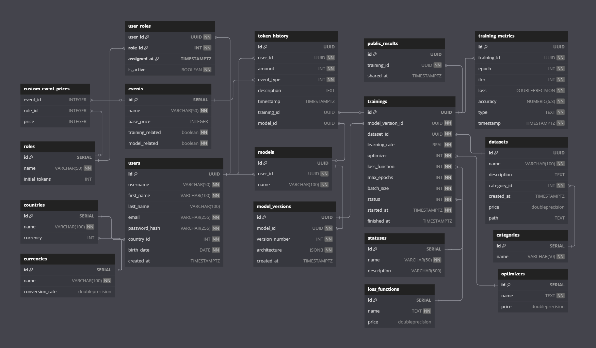

# AI-Playground

**AI-Playground** is a desktop app for experimenting with simple neural networks. It features a built-in token system, leaderboard tracking, and an intuitive JavaFX interface — perfect for learning, testing, or just having fun with AI.

> This project was developed as part of the **Object-Oriented Programming** and **Data Engineering** courses at the Jagiellonian University.


---

# 🚀 Key Features

- 🧠 **Build Neural Nets** from modular layers like `Linear`, `ReLU`, `GELU`, `Dropout`, and more  
- 🏋️‍♂️ **Train Networks** using:
  - 5 built-in datasets
  - 5 different optimizers
  - Appropriate loss functions for each use case
- 🏆 **Global & National Leaderboards** – see how your models rank!
- 👥 **User Management**:
  - Register new users
  - Manage accounts via an admin panel
- 💰 **Token System**:
  - Every action like training a model or creating a new one consumes tokens
  - Users can **buy tokens** or **earn them** by reaching high positions on the leaderboards
    
---

# 🧱 Architecture

The app follows the **MVVM (Model-View-ViewModel)** design pattern:

- **Model**: Core neural network logic and data structures (custom implementation in Java)
- **View**: JavaFX-based UI
- **ViewModel**: Connects UI to business logic, enabling clean separation of concerns

## 🛠 Tech Stack

- **Frontend**: JavaFX (Desktop UI)
- **Core Logic & ViewModels**: Java
- **Neural Networks**: Implemented from scratch (no external ML libraries)
- **Database**: PostgreSQL

## 🧠 Core Package

The `core` package contains the fundamental logic for building and training neural networks — fully implemented in Java without external machine learning libraries.

### Key Components:

- **`NeuralNet`** – Manages model architecture, training loop, and callbacks.
- **`Tensor`** – Custom multidimensional array with automatic differentiation support.
- **`ComputationalGraph`** – Handles gradient calculation via a topologically sorted DAG.
- **`Dataset`** – Loads, splits, and prepares data from disk into tensors.

### Submodules:

- **`layers`** – Implementations of layers like `Linear`, `ReLU`, `Dropout`, etc.
- **`optim`** – Optimizers including `SGD`, `Adam`, `RMSProp`, etc.
- **`loss`** – Loss functions such as `MSE`, `CrossEntropy`, `BCE`.
- **`evalMetric`** – Accuracy and other evaluation metrics.
- **`examples`** – Sample neural networks showcasing library usage.

## 🧰 Services & Repositories

Services encapsulate business logic and data validation, and delegate raw SQL/database operations to their respective repositories. Each service corresponds to a key domain of the application.

### Main Services:

- **`UserService`**, **`TokenService`** – Manage user lifecycle, authentication, token balances, and transactions.
- **`ModelService`** – Allows creating and modifying models with versioning support.
- **`TrainingService`** – Controls training sessions and stores training metrics.
- **`LeaderboardService`** – Provides public result sharing and leaderboard computation.

Each service uses a repository (`UserRepository`, `ModelRepository`, etc.) built with **jOOQ** and **raw SQL**. The database layer is abstracted, so it can be swapped with another implementation if needed.

Services handle exceptions (like `DatabaseException`) and validate all user input, often using Form DTOs (e.g. `LoginForm`, `RegisterForm`) that are first checked against regex patterns, then against database state.

## 📤 Data Transfer Objects (DTOs)

The `dto` package defines record types and enums that carry structured data between the different layers of the application.

### Subpackages:

- **`architecture`** – Declarative objects representing model structure:
  - `LayerType`, `LayerParams`, and `LayerConfig` are used to dynamically build and serialize model layers.
  - `OptimizerType`, `LossFunctionType`, `DatasetType` map GUI and DB values to internal logic.
  
- **`form`** – User-submitted forms like `LoginForm`, `ModelForm`, `RegisterForm`, etc.
- **`validation`** – Classes that validate form input using regex and logical rules.
- **Other DTOs** – Include domain-specific records like `ModelDto`, `UserDto`, `TrainingDto`, and `LeaderboardDto`.

DTOs abstract and centralize data passing across the application, ensuring consistency, type safety, and testability.

## ❗ Exception Handling

Custom exceptions are used to signal either internal application failures or expected business rule violations.

Examples include:

- **`DatabaseException`** – For SQL or data-layer failures.
- **`UserModificationException`**, **`TrainingException`** – For failed user actions like invalid login or invalid model setup.
- **`InsufficientTokensException`** – Triggered when a user lacks tokens to perform an action.
- **`ModelModificationException`**, etc.

These exceptions are caught in view models and surfaced to the user via readable messages in the UI.

## 🔗 ViewModels

ViewModels act as the glue between the UI and backend logic. They handle input events from the GUI, transform DTOs, interact with services, and expose observable properties for real-time UI updates.

- **`UserViewModel`**, **`TokenViewModel`** – Manage user accounts, login/register, and token economy.
- **`MainViewModel`** – Central to the app: manages model editing, training, versioning, and metrics tracking.
- **`TokenViewModel`** – Manages the token shop, token balance, and transactions.
- **`LeaderboardViewModel`** – Displays and filters global and local leaderboards.
- **`ViewModelFactory`** – Simplifies dependency injection and construction of view models across scenes.

Each ViewModel wraps backend services and exposes clean interfaces for the UI.

## 🎨 View (JavaFX)

The View layer is implemented using **JavaFX**, with `.fxml` files describing layouts and matching controller classes handling interactions.

Controllers:
- Bind UI elements (e.g. labels, tables, buttons) to ViewModel properties.
- Listen to user events and forward them to ViewModels.
- React to ViewModel state changes (e.g. updating a plot during training)
- Dynamically generate UI elements for neural network layers using `LayerType` enums.

Thanks to `LayerConfig` and other DTOs, **no specific layer logic is hardcoded in the UI**. This makes the app modular and easily extensible with new types of layers or training configurations.

---

# 🛠 Running the App

### ✅ Requirements:
- Java 17+
- PostgreSQL installed and running
- Internet access (for Gradle dependencies)

### 🗄️ Database Initialization:
Navigate to the `scripts/` folder and run the database setup script:

#### On Windows:
```powershell
.\init_db.ps1
````

#### On Linux/macOS:

```bash
./init_db.sh
```

These scripts will create the schema and populate it using the SQL files in `scripts/db/`, including:

```
create.sql      -- Table definitions
fill.sql        -- Default data (countries, roles, datasets, etc.)
triggers.sql    -- Postgres triggers (optional)
```

> Make sure PostgreSQL is running and accessible before executing the script.

### 🏃 Running the App:

If running from source:

```bash
./gradlew run
```

If using a standalone `.jar` file:

```bash
java -jar ai-playground.jar
```

> Note: You must have Java installed to run the `.jar`.

---

## 🗂️ Database Schema

The following diagram illustrates the relationships between all database tables:


